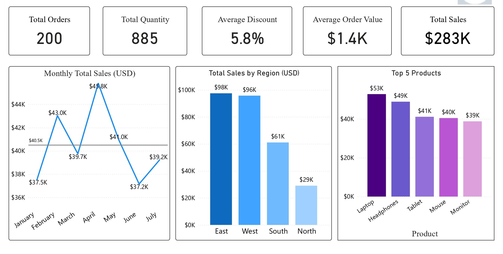

# Retail Sales Dashboard (Power BI)

## Overview
This project presents a Power BI dashboard analyzing retail sales performance. The dashboard provides insights into revenue trends, product performance, and key business KPIs to support data-driven decision making.

## Dataset
The dataset includes retail transaction data containing:
- Sales amount
- Product categories
- Order dates
- Customer information

## Key KPIs
- Total Sales
- Total Orders
- Average Order Value
- Sales Growth Trend

## Dashboard Features
- Time-based sales analysis
- Category-wise performance
- KPI tracking for business decisions
- Clean and interactive visuals
  

## Tools Used
- Power BI
- DAX
- Data Cleaning & Transformation

## Files Included
- Power BI file (.pbix)
- Dashboard PDF
- Dashboard images

## Key Insights
- Identified top performing product categories
- Observed sales trends over time
- Highlighted revenue contribution patterns
